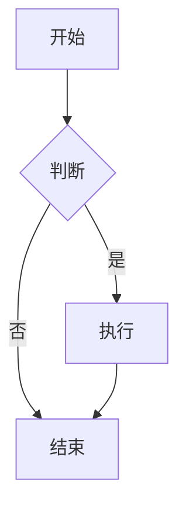

# Markdown 语法说明书

欢迎使用 Markdown！这是一份简洁的语法指南，帮助你快速掌握 Markdown 的常用语法。

---

## 1. 标题

使用 `#` 号来创建标题，一个 `#` 是一级标题，两个 `##` 是二级标题，以此类推。

```markdown
# 一级标题
## 二级标题
### 三级标题
#### 四级标题
##### 五级标题
###### 六级标题
```

**效果：**
# 一级标题
## 二级标题
### 三级标题

---

## 2. 文本样式

### 粗体
用两个 `**` 或 `__` 包围文本：

```markdown
**这是粗体文本**
__这也是粗体文本__
```

**效果：** **这是粗体文本**

### 斜体
用一个 `*` 或 `_` 包围文本：

```markdown
*这是斜体文本*
_这也是斜体文本_
```

**效果：** *这是斜体文本*

### 删除线
用两个 `~~` 包围文本：

```markdown
~~这是删除线文本~~
```

**效果：** ~~这是删除线文本~~

### 行内代码
用反引号 `` ` `` 包围代码：

```markdown
这是 `行内代码` 示例
```

**效果：** 这是 `行内代码` 示例

---

## 3. 列表

### 无序列表
使用 `-`、`*` 或 `+` 加空格：

```markdown
- 项目一
- 项目二
  - 子项目
  - 子项目
- 项目三
```

**效果：**
- 项目一
- 项目二
  - 子项目
  - 子项目
- 项目三

### 有序列表
使用数字加点号：

```markdown
1. 第一项
2. 第二项
3. 第三项
```

**效果：**
1. 第一项
2. 第二项
3. 第三项

### 任务列表
使用 `- [ ]` 或 `- [x]`：

```markdown
- [ ] 未完成任务
- [x] 已完成任务
- [ ] 待办事项
```

**效果：**
- [ ] 未完成任务
- [x] 已完成任务
- [ ] 待办事项

---

## 4. 链接和图片

### 链接
使用 `[文字](链接地址)`：

```markdown
[点击访问示例网站](https://example.com)
```

**效果：** [点击访问示例网站](https://example.com)

### 图片
使用 ``：

```markdown

```

### 带链接的图片
```markdown
[](链接地址)
```

---

## 5. 引用

使用 `>` 加空格：

```markdown
> 这是一段引用文本。
> 可以多行书写。
>
> 还可以有空行。
```

**效果：**
> 这是一段引用文本。
> 可以多行书写。
>
> 还可以有空行。

### 嵌套引用
```markdown
> 第一层引用
>> 第二层引用
>>> 第三层引用
```

---

## 6. 代码块

### 行内代码
使用单个反引号：

```markdown
`console.log("Hello")`
```

### 代码块
使用三个反引号，并指定语言：

````markdown
```javascript
function hello() {
  console.log("Hello, World!");
}
```
````

**效果：**
```javascript
function hello() {
  console.log("Hello, World!");
}
```

### 常用语言标识
- `javascript` / `js`
- `python` / `py`
- `html`
- `css`
- `java`
- `c` / `cpp`
- `rust`
- `go`
- `typescript` / `ts`
- `json`
- `xml`
- `sql`
- `bash` / `shell`
- `markdown` / `md`

---

## 7. 表格

使用竖线 `|` 和连字符 `-`：

```markdown
| 列1 | 列2 | 列3 |
| --- | --- | --- |
| 内容1 | 内容2 | 内容3 |
| 内容4 | 内容5 | 内容6 |
```

**效果：**
| 列1 | 列2 | 列3 |
| --- | --- | --- |
| 内容1 | 内容2 | 内容3 |
| 内容4 | 内容5 | 内容6 |

### 对齐方式
```markdown
| 左对齐 | 居中对齐 | 右对齐 |
| :--- | :---: | ---: |
| 内容 | 内容 | 内容 |
```

---

## 8. 分割线

使用三个或更多的 `-`、`*` 或 `_`：

```markdown
---
***
___
```

**效果：**

---

## 9. 转义字符

使用反斜杠 `\` 转义特殊字符：

```markdown
\*这不是斜体\*
\[这不是链接\]
\`这不是代码\`
```

**效果：**
\*这不是斜体\*
\[这不是链接\]
\`这不是代码\`

---

## 10. 脚注

使用 `[^标识]` 和 `[^标识]: 说明`：

```markdown
这是一个脚注示例[^1]。

[^1]: 这是脚注的内容。
```

---

## 11. 数学公式（部分编辑器支持）

### 行内公式
使用单个 `$`：

```markdown
$E = mc^2$
```

### 块级公式
使用两个 `$$`：

```markdown
$$
\sum_{i=1}^{n} x_i = x_1 + x_2 + \cdots + x_n
$$
```

---

## 12. 流程图（部分编辑器支持）

```markdown

```

---

## 快捷键提示

| 操作 | 快捷键 |
|------|--------|
| 保存文件 | `Ctrl + S` |
| 新建文件 | `Ctrl + N` |
| 打开文件 | `Ctrl + O` |
| 加粗 | `Ctrl + B` |
| 斜体 | `Ctrl + I` |
| 缩进 | `Tab` |
| 反缩进 | `Shift + Tab` |

---

## 最佳实践

1. **保持简洁**：Markdown 的核心是易读易写
2. **使用空行**：段落之间用空行分隔
3. **一致风格**：在整个文档中保持一致的标记风格
4. **预览检查**：写完后预览检查格式是否正确
5. **适度使用**：不要过度使用格式，保持内容清晰

---

**提示：** 在 FileWithJob 中，你可以使用工具栏按钮快速插入这些语法！

---

*最后更新：2026年7月*